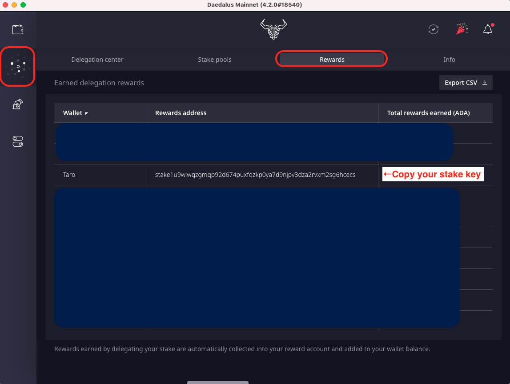
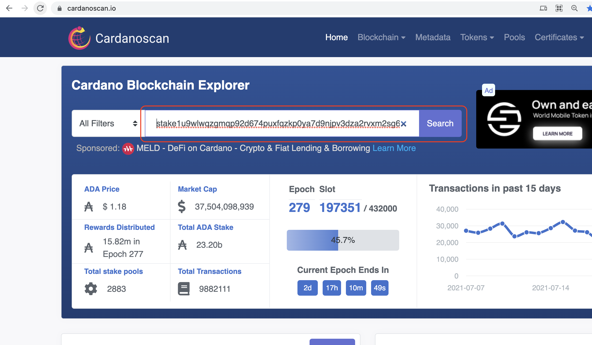
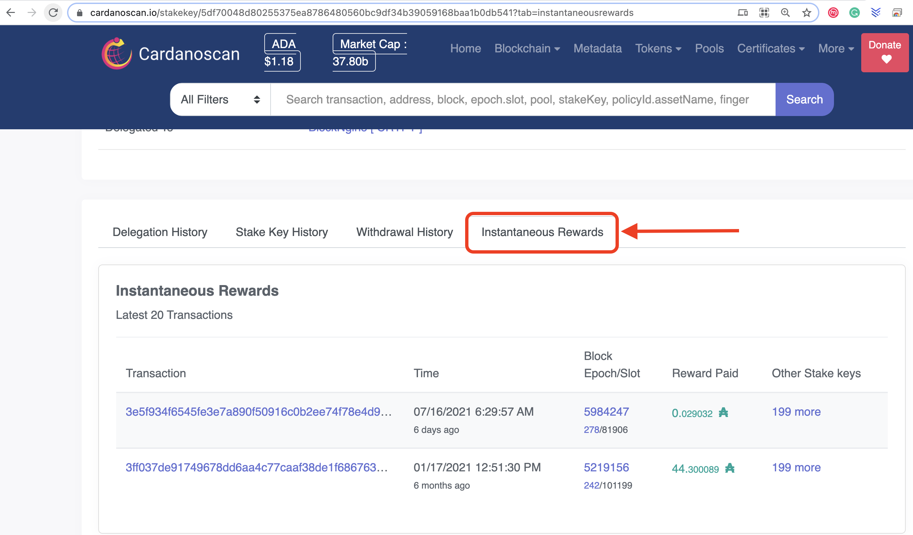
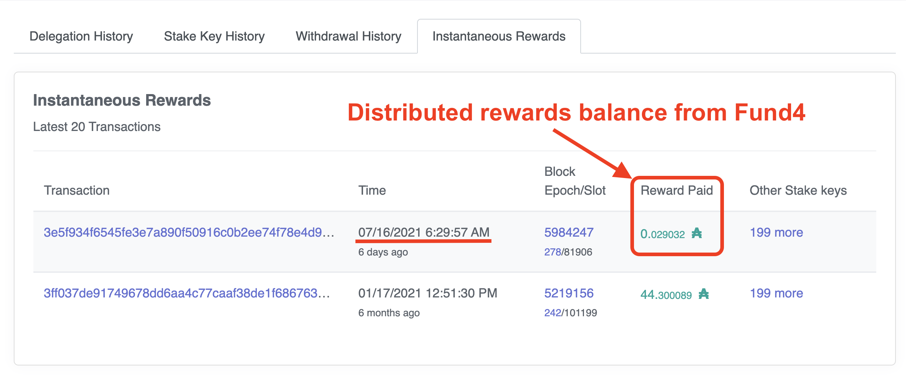

# Confira as recompensas ganhas

O seguinte ajuda você a verificar as recompensas recebidas do Project Catalyst.

1. Abra a guia Recompensas no Daedalus e copie sua chave de aposta.

1. Abra o [Cardanoscan](https://cardanoscan.io) e cole sua chave de aposta e clique em **Pesquisar**

3\. Clique em **Recompensas Instantâneas**

1. Você pode ver o último saldo de recompensas distribuídas aqui:

