# Registro na votação

Leia a [visão geral do eleitor](voter-guide.md) para entender porque se registrar para votação.

## Pré-requisitos

1. O registro é suportado através de cada um dos seguintes:
   * [Daedalus Mainnet](https://daedaluswallet.io/en/download/) (desktop, Ledger Nano S and X, Trezor T)
   * [Yoroi mobile](https://yoroi-wallet.com/#/) (iOS and Android, Ledger Nano S)
   * [Yoroi browser extension](https://yoroi-wallet.com/#/) (desktop, Ledger Nano S and X)
   * [AdaLite-Ledger](https://adalite.medium.com/catalyst-voting-registration-on-adalite-71d975f75755) (desktop, hardware wallet, sem suporte para mobile)
   * [AdaLite-Trezor](https://adalite.medium.com/catalyst-voting-registration-on-adalite-71d975f75755) (desktop, hardware wallet, sem suporte para mobile)
   * [Adalite-Mnemonics](https://adalite.medium.com/catalyst-voting-registration-on-adalite-71d975f75755) (desktop, software wallet)
   * [Hardware wallet via CLI interface](https://github.com/vacuumlabs/cardano-hw-cli#catalyst-voting-registration) + [Guide](https://github.com/gitmachtl/scripts/blob/master/SPO\_Pledge\_Catalyst\_Registration.md#how-to-vote-with-funds-also-pledge-on-hardware-wallets-new)
   * [VotingTools CLI](https://github.com/input-output-hk/voting-tools)
2. Requisito mínimo de 500 ADA _excluindo recompensas_
3. Antes do registro, você deve instalar a versão mais recente do aplicativo Catalyst Voting em seu dispositivo móvel (versão 0.1.13). Observe que o iPhone 6 e versões anteriores não são compatíveis. Usuários do Android: Baixe “[Catalyst Voting](https://play.google.com/store/apps/details?id=io.iohk.vitvoting\&pli=1)” na Google Play Store. Usuários IOS: Baixe “[Catalyst Voting](https://apps.apple.com/fr/app/catalyst-voting/id1517473397?l=en)” na loja IOS.
4. O registro deve ser concluído antes da data do snapshot&#x20;
5. Nota: há uma taxa de registro de 0,17 -0,18 ADA

Cadastro&#x20;

IMPORTANTE: Se você se inscreveu no Fundo 4 e/ou no Fundo 5 e conseguiu votar - sua inscrição será automaticamente válida para a rodada de votação do Fundo 6! Desde que você ainda tenha seu código QR e PIN. Não precisa se registrar novamente. Isso não se aplica aos registros do Fundo 2 ou do Fundo 3. Seu poder de voto, no entanto, será atualizado durante o novo instantâneo relevante para o Fundo 6. Para o Fund6, apenas o registro eleitoral está aberto no momento. Você receberá o código QR e PIN da carteira que você usa para se registrar. Independentemente da sua carteira, cada registro fornecerá a você um código QR e PIN exclusivo. Estes devem ser absolutamente salvos. Nenhum código QR salvo, nenhum voto! Nenhum código PIN salvo, nenhum voto!

1. Instale a versão mais recente do aplicativo Catalyst Voting (versão 0.1.15) em seu dispositivo móvel.
2. Na versão mais recente do Daedalus, navegue até a página de registro de votação no menu à esquerda. Confirme se você instalou o aplicativo Catalyst Voting. Confirme se você possui pelo menos 500 ADA no momento do snapshot. Clique em "Cadastre-se para votar"

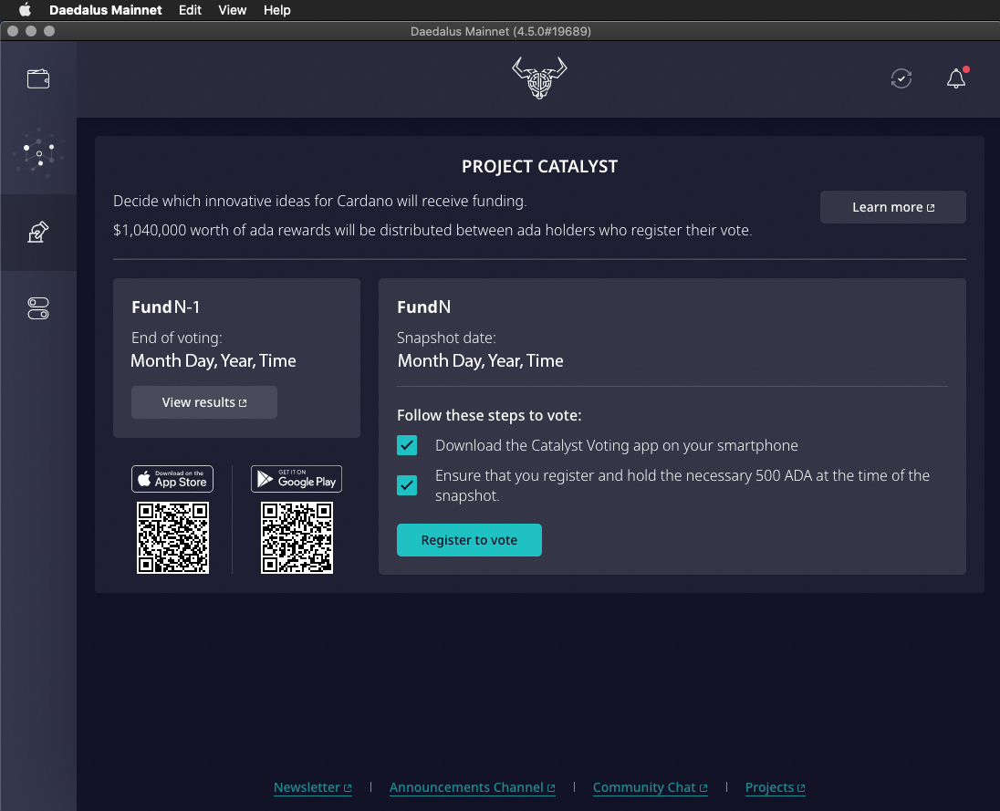

3\. Selecione a carteira com a qual deseja votar e clique em "Continuar" (certifique-se de que a carteira contém o valor mínimo necessário para votação: 500 ADA _excluindo recompensas_)

Nota: Este valor deve permanecer nesta carteira até o instantâneo, que coletará seu poder de voto. As datas e horários dos instantâneos de cada Fundo serão divulgados por meio de nossos canais sociais e de comunicação oficiais.

4\. Digite a senha de gastos de sua carteira ou conecte sua carteira de hardware e clique em "Enviar transação de registro":

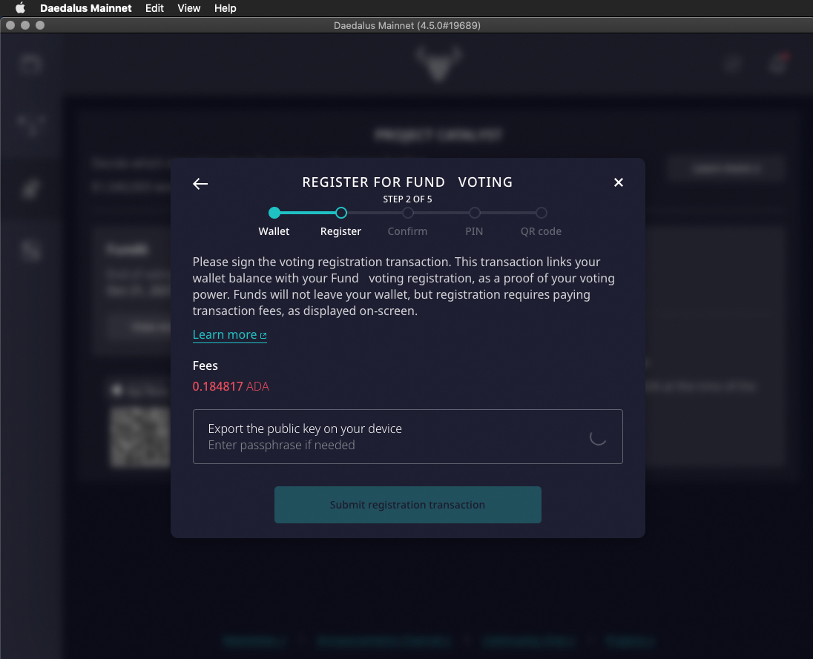

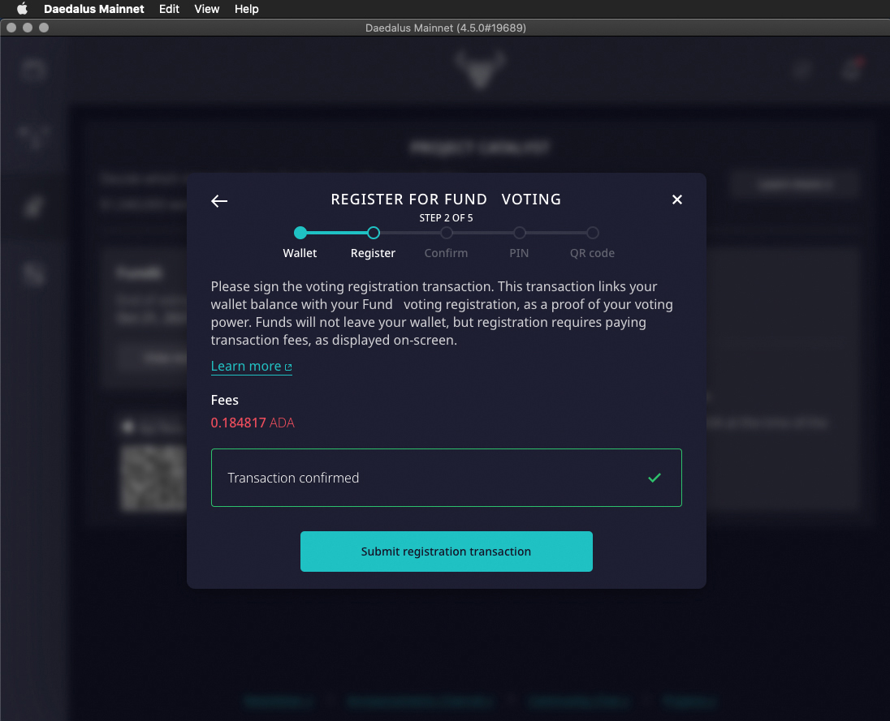

5\. Aguarde aproximadamente 5 minutos até que a transação seja confirmada pelo blockchain e clique em "Continuar". Não feche o Daedalus durante esse período, caso contrário seu cadastro será cancelado e você precisará recomeçar:

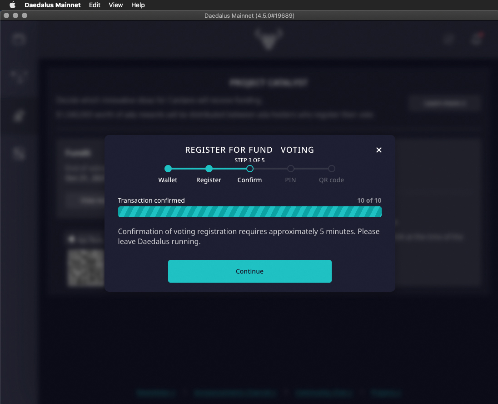

6\. Defina um código PIN de 4 dígitos à sua escolha, confirme-o e clique em "Continuar". Por favor, certifique-se de lembrá-lo ou anotá-lo, pois você precisará dele para votar mais tarde. Note que se perder o PIN não poderá votar e terá de repetir o processo de registo para selecionar um novo PIN.

7\. A Daedalus irá gerar um código QR que você usará no Catalyst App para completar o cadastro e dar seus votos. Clique em "Salvar como PDF" Clique em "Salvar" na caixa de diálogo Observe que, se você não salvar o código QR, não poderá concluir seu registro e votar.

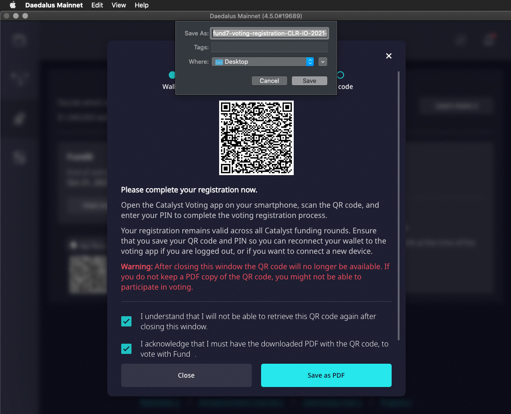

8\. Aguarde a mensagem de confirmação "PDF baixado com sucesso" e clique em "Fechar".&#x20;

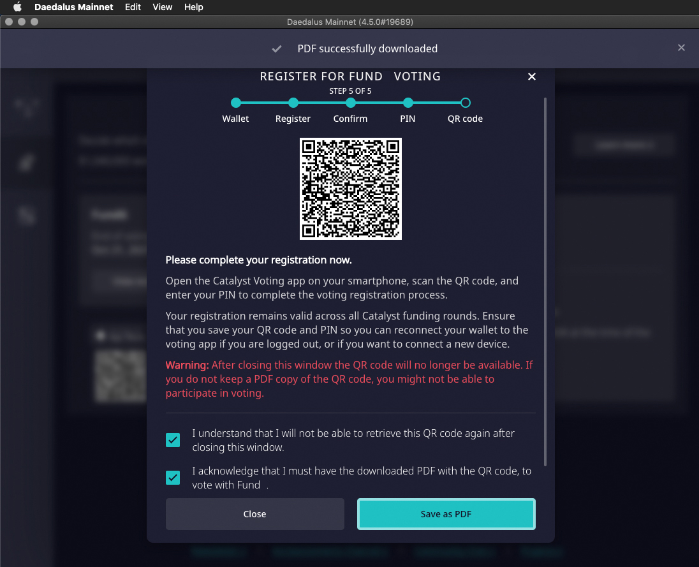

NO SEU CELULAR&#x20;

9\. Abra o aplicativo Catalyst Voting em seu dispositivo móvel e toque em "Vamos começar" ou "Pular":

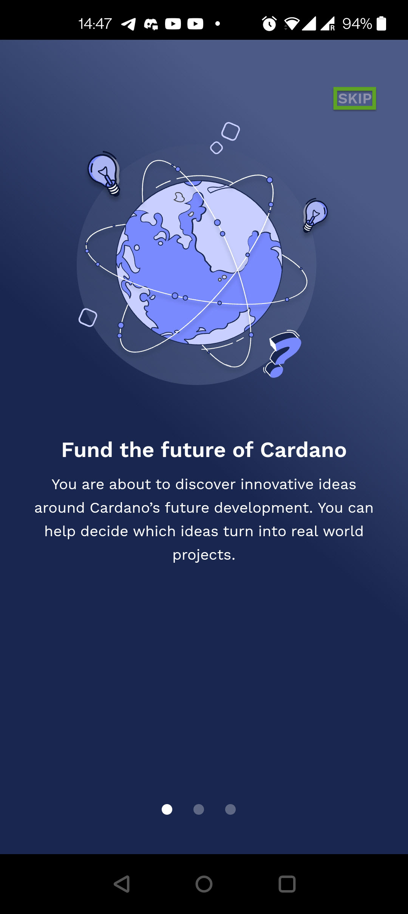

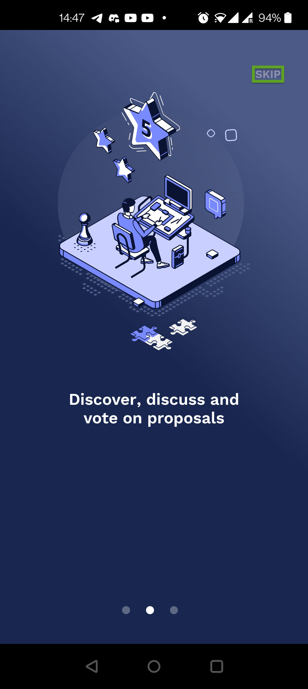

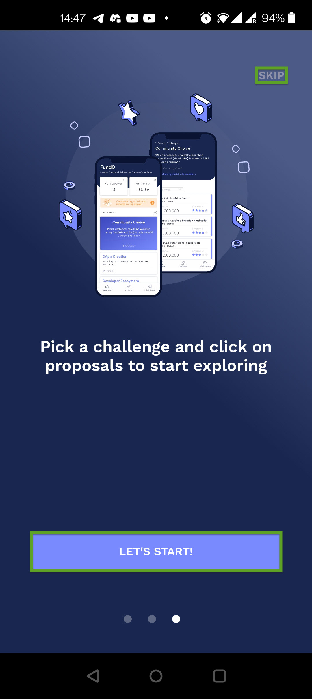

10\. Próximo - clique em "se registrar agora".

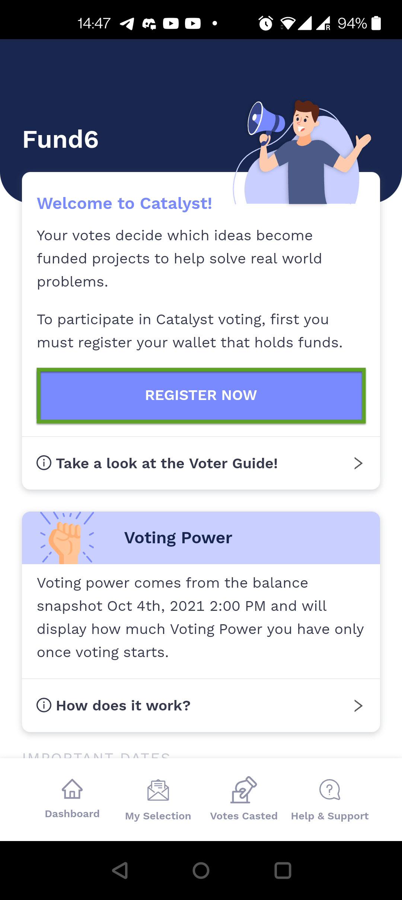

11\. Em seguida - toque em "Escanear código QR de votação" e escaneie o código QR, que você recebeu na Etapa 7.

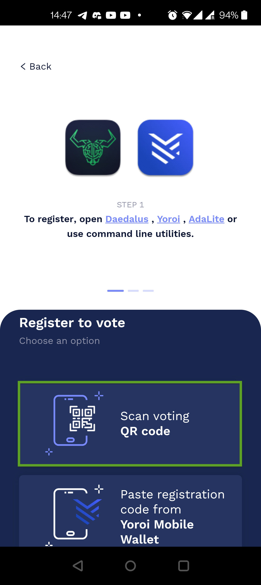

12\. Digite o código PIN de 4 dígitos, que você definiu na Etapa 6 e toque em "Confirmar".

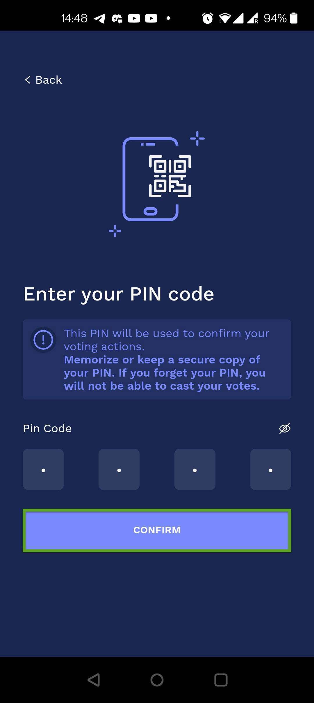

Assim o processo de registro é concluído.

### Votação&#x20;

13\. Agora você precisa esperar até que a votação comece. Quando a votação começar, você verá seu poder de voto, correspondente à quantidade de ADA, que você tinha em sua carteira no momento do instantâneo. No nosso caso, o poder de votação será 984.

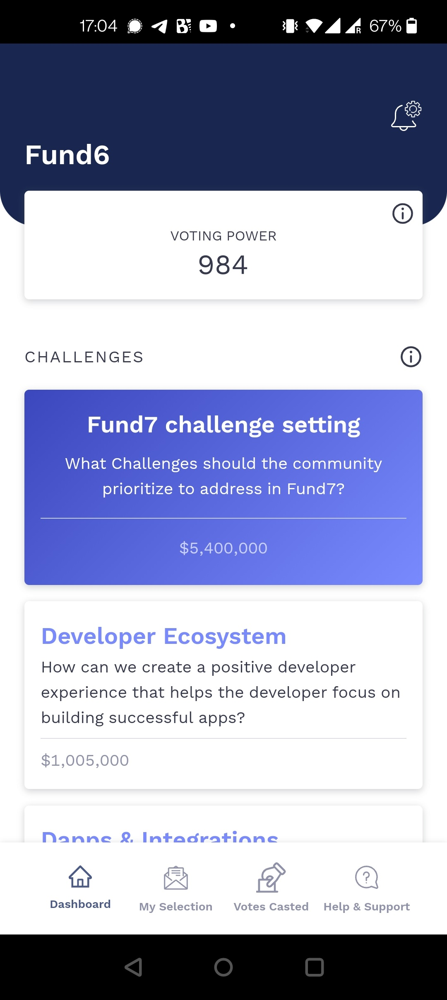

14\. Leia as diferentes propostas e vote (sim ou não). Você pode votar em uma única proposta, em várias propostas ou em todas as propostas - você decide. O número de votos não afetará o valor da sua recompensa, mesmo se você não votar.

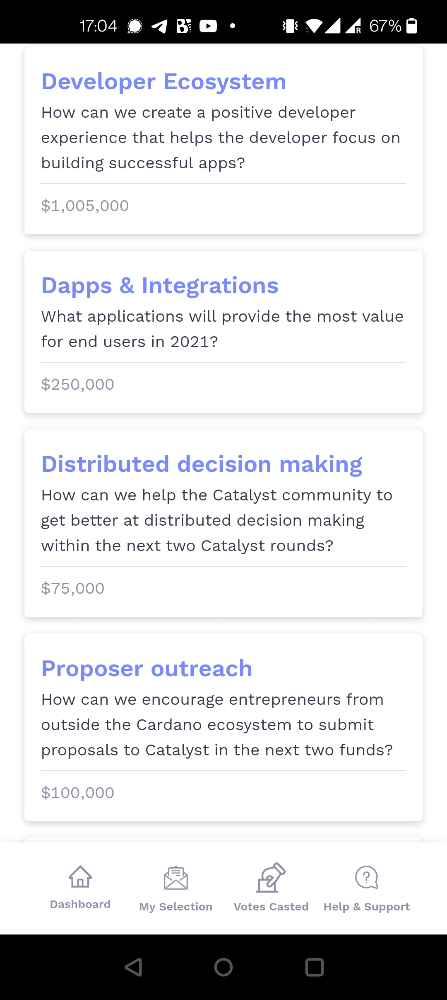

15\. Selecione uma proposta.

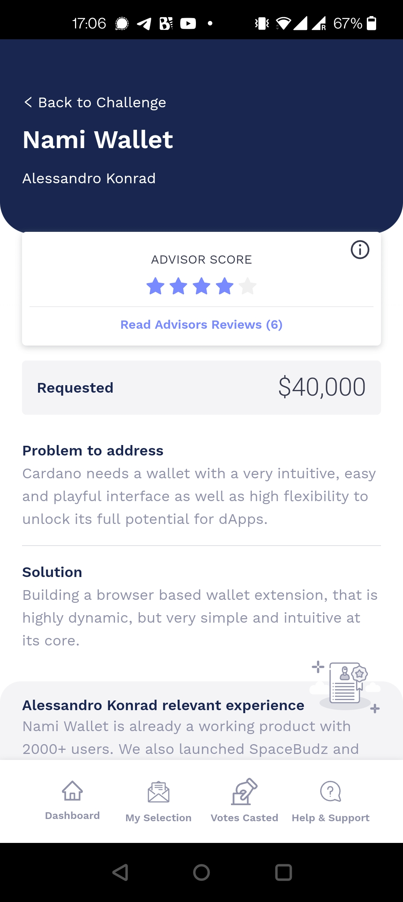

16\. Após cada votação, o aplicativo Catalyst Voting irá lembrá-lo de que seus votos ainda não foram enviados.

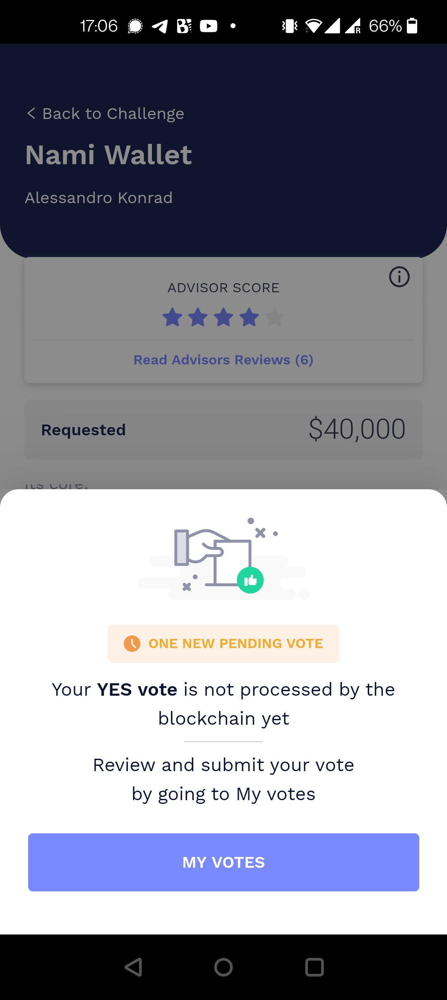

17\. Quando estiver pronto para enviar seus votos, vá para a seção "Meus votos" e toque em "Dar meus votos".

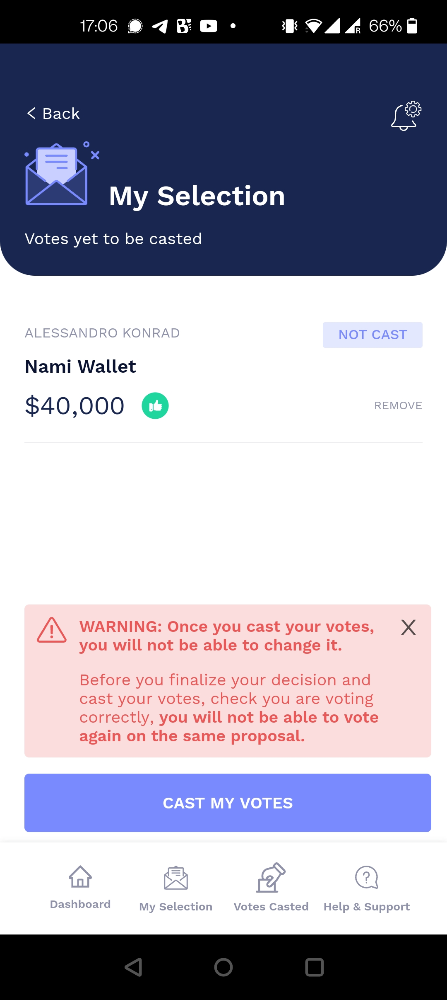

18\. Digite seu PIN (você o selecionou na Etapa 6) para autorizar os votos e toque em "Confirmar".

19\. Você verá uma mensagem de confirmação dizendo que seus votos foram enviados para o blockchain. Isso conclui o processo de votação.

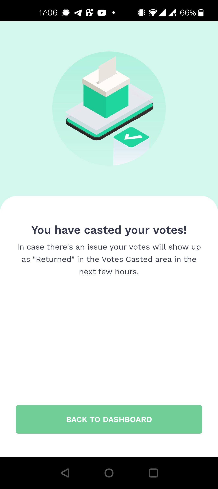

__

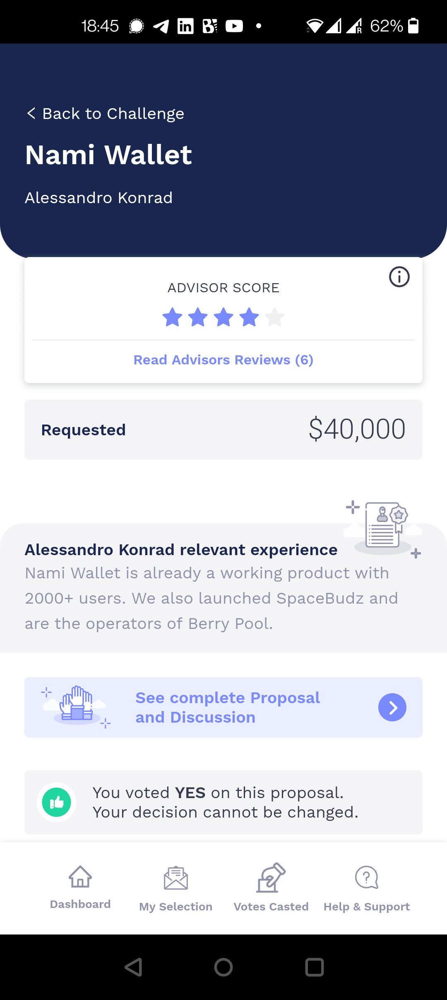

## Como relatar possíveis problemas e bugs

Se você se registrou usando o Daedalus, envie uma solicitação de suporte do aplicativo Catalyst Voting.&#x20;

Se você se registrou usando Yoroi, envie uma solicitação aqui: [https://yoroi-wallet.com/#/support](https://yoroi-wallet.com/#/support)

Se você se registrou via AdaLite: envie uma solicitação por e-mail para: [adalite@vacuumlabs.com](mailto:adalite@vacuumlabs.com)

## **Resources**

* [iOS Catalyst App](https://apps.apple.com/app/id1517473397)
* [Android Catalyst App](https://play.google.com/store/apps/details?id=io.iohk.vitvoting)
* [Guia de inscrição e votação ](https://iohk.zendesk.com/hc/en-us/articles/900005679386)
* [Tudo o que você precisa saber - Votação do Fundo 6](https://www.reddit.com/r/cardano/comments/p2xpi8/project\_catalyst\_all\_you\_need\_to\_know\_fund6\_voter/)&#x20;
* [Exemplos de recompensa de votação de fundos catalisadores](https://docs.google.com/document/d/1Z2qLzGbLQxLgfDKqnTZFTL3IM28V8uUykptng0p5jbE/edit)

**Recursos da comunidade**


Os seguintes recursos não são mantidos pela IOHK, mas foram usados pela comunidade, tenha cuidado com golpes


* [Registro de votação do operador de pool de participação.](https://github.com/gitmachtl/scripts/blob/master/SPO\_Pledge\_Catalyst\_Registration.md)
